# AS-Portfolio

## Description

Newly redesigned portfolio page. Now includes images and links for homework projects: Coding Quiz Challenge, Weather Dashboard App, and Work Day Scheduler. The featured work panel for major projects now features Project 1:  News Flash App. Redesigned the About section so that it is initially hidden and only the work project sections are diplayed on initial load. Clicking the Navbar buttons for About and Work will toggle the content visibility for those sections.
The work sections each have a heading label that will reveal the projects associated with the respective section when the heading is clicked. Each project has a title element that will load the GitHub repository page for that project in a separate tab. Clicking on the image will load published app page in separate tab.

## Installation

My files can be accessed in the repository [HERE](https://github.com/arcangyl1963/AS-Portfolio)
The image below shows the repository where my project files are located:

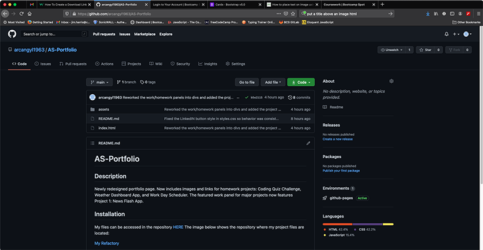

The web application can be viewed [HERE](https://arcangyl1963.github.io/AS-Portfolio/).

The images below show the updated portfolio page design and highlights to some of the new features that have been added:

The main page shows the redesigned layout featuring an updated theme and background image. The work project sections are displayed by default while the About bio section is hidden.

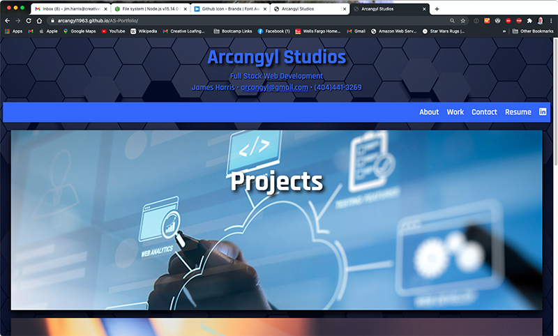

Clicking the About button in the navbar while hide the work project sections and reveal the About bio content. Note the About nav button color changes when it is the active selection.

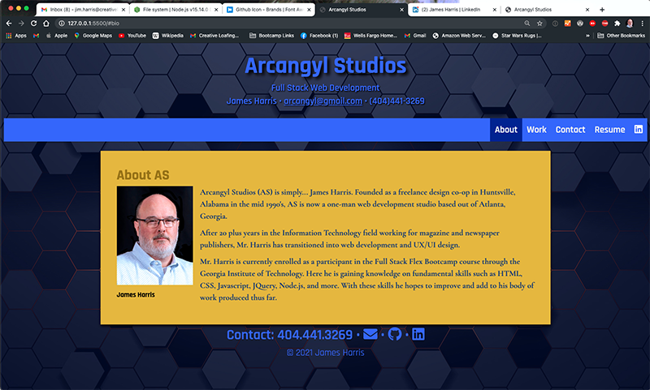

Hovering the cursor over the navbar buttons will also change the color theme of the button contents.

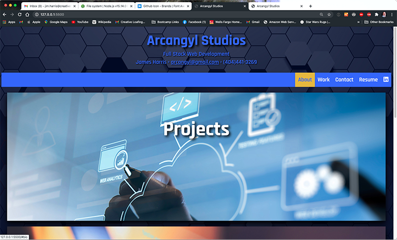

Clicking another navbar button will return the previously active button to the inactive theme state and the clicked button will display as active. Clicking the Work button reveals the work projects section and hides the About Bio section content.

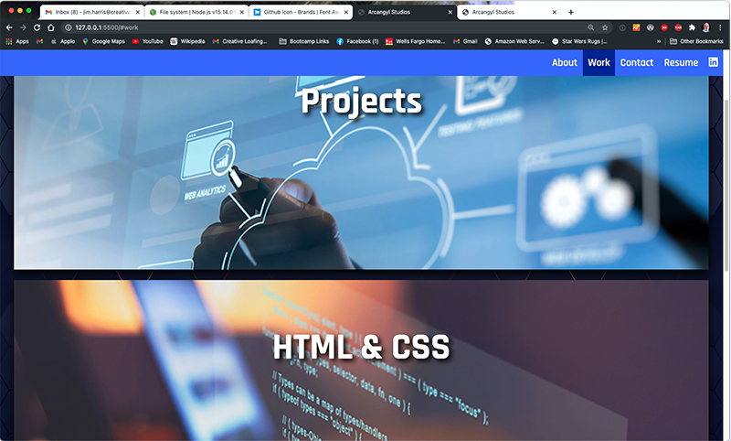

Clicking the Contact button auto-scrolls to display the Contact info located in the footer. Note the sticky-behavior of the navbar while scrolling the page.

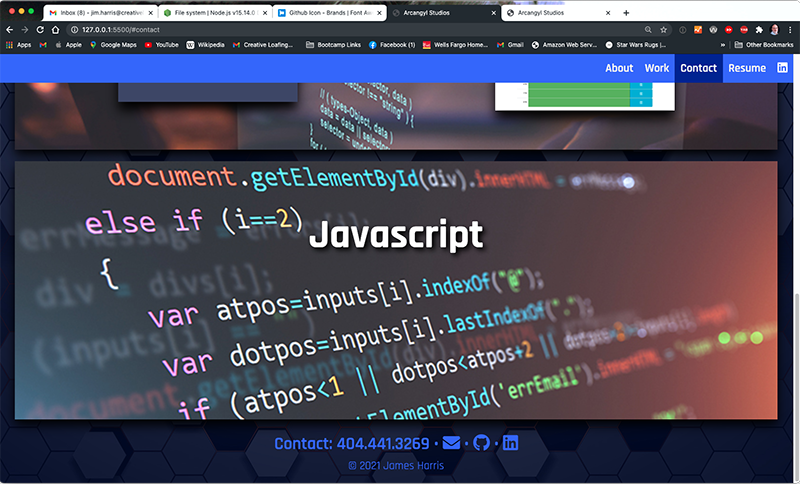

When you mouse-over the icon links for my email, my GitHub repositories, and LinkedIN profile, the icons change color.

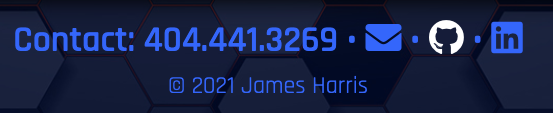

Clicking the Resume button opens a PDF version of my updated resume in a new tab. The PDF can be viewed, printed, or downloaded using the built-in PDF viewer capabilities of most modern browsers.

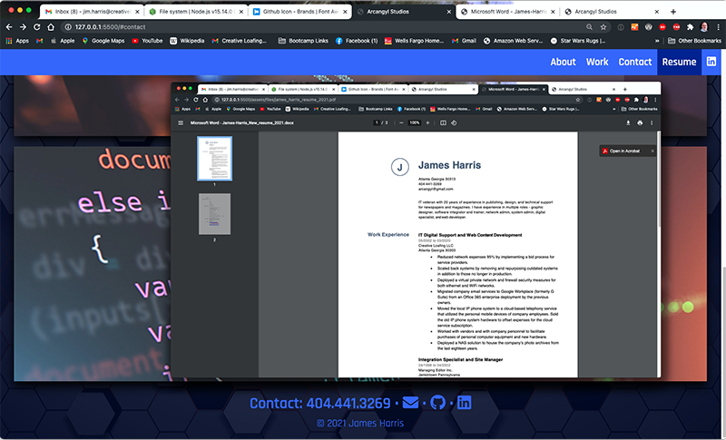

Click the Work navbar button to reveal the projects section. There are three sections - Projects (for the three major projects), HTML & CSS, and Javascript.

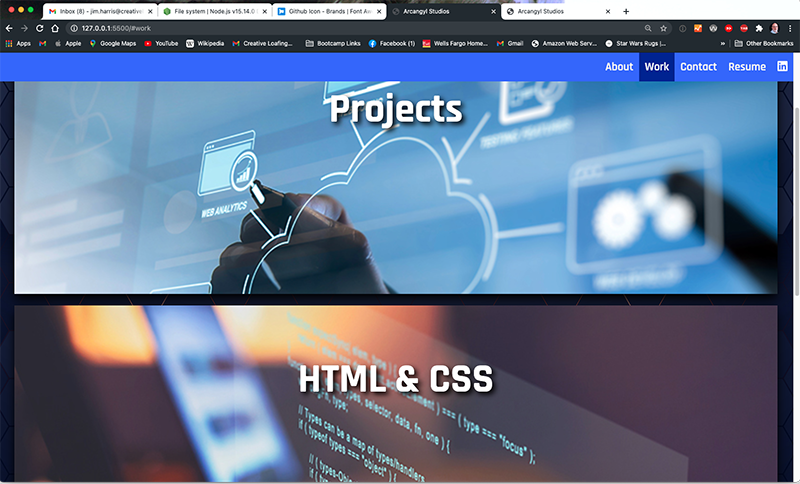

Clicking on the section heading; i.e. "Projects", will reveal the project panels associated with each section. There is room to add additional panels for future projects and assigments. Our Project 1 panel is featured in the Projects section.

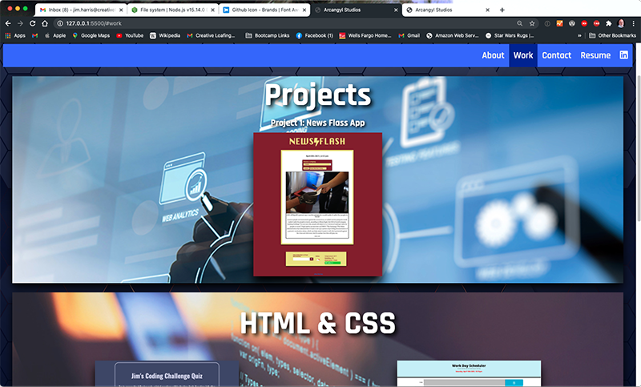

Clicking on the project's image will open the application's published page from GitHub in new tab or window. Clicking on the project title will open the GitHub repository for the project.

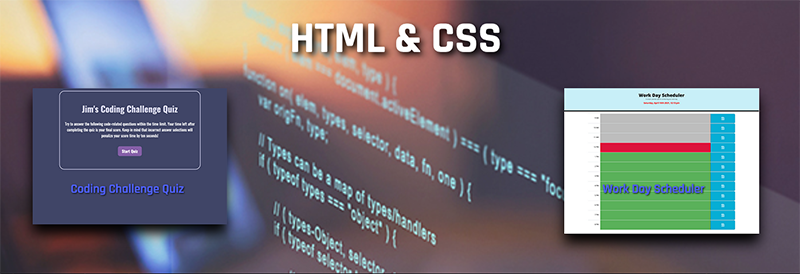

© 2021 arcangyl studios